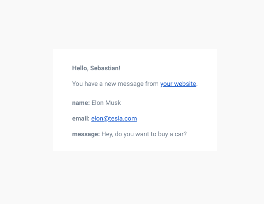

# planetExpress
planetExpress is a form backend, API and email service for HTML forms.

# Installation
```
npm install
```

# Before running
You must to set the next environment variables:
| Environment variable | Description |
| :---------: | :---------: |
| SENDGRID_API_KEY | Sendgrid api key. You can get your api key [here](https://sendgrid.com/). |
| EMAIL_FROM | Email with which you want to send the notification. |
| EMAIL_TO | Email where you want to receive de the notification. |
| REDIRECT_URL | URL to redirect the user after submitting the form. |
| WEBSITE | URL of the site where the form is located. |
| USER_NAME | Your name. |

# Run
```
node .
```
or
```
nodemon .
```

# Example
## Code

```
<form action="http://localhost:3002/sendForm" method="post">
  <label for="name">Name</label>
  <input name="Name" id="name" type="text">
  
  <label for="email">Email</label>
  <input name="Email" id="email" type="email">
  
  <label for="message">Message</label>
  <input name="Message" id="message" type="email">
  
  <button type="submit">Submit</button>
</form>
```

## Email

